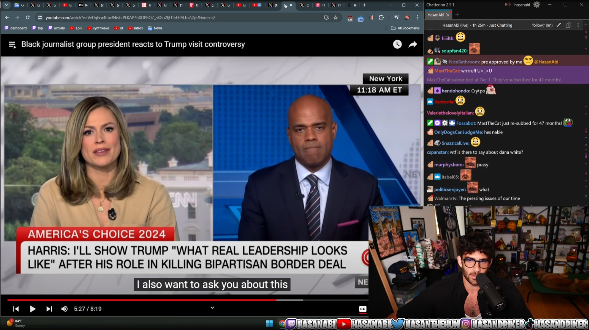
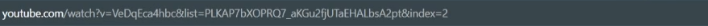
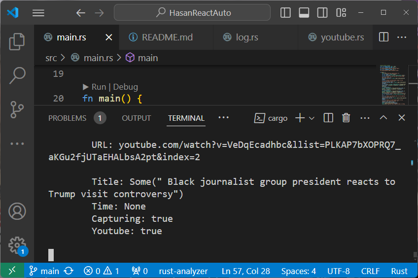
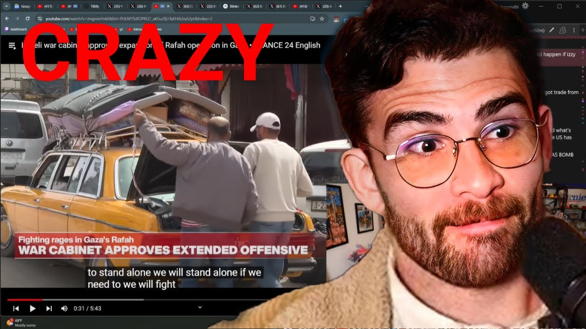
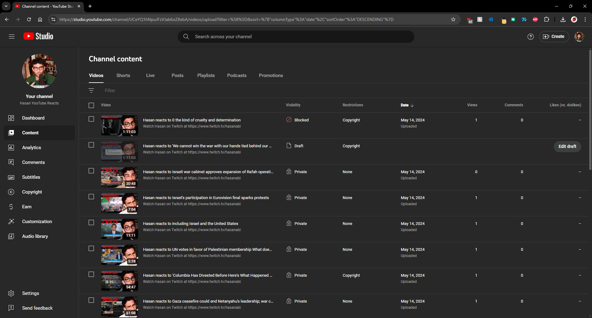

# Hasan React Auto

## Overview

This is a program designed to automate the process of posting YouTube videos of Hasan "hasanabi" Piker reacting to YouTube videos.

It actively watches the stream, notices when he starts watching a video, starts recording, notices when he stops watching it, stops recording, decides on a title, generates a thumbnail, and uploads the video. Or, at least, all of that is the goal.

## Process

The app runs while one is also running hasanabi's stream in a browser. The user points the app to where on their screen the stream is being played, which the app will take screenshots of.

From this screen shot, it can gather a decent amount of information: most importantly being the browser address bar that hasanabi so kindly keeps visible and in a stationary spot for us.

This is then parsed into text with OCR, which helps the app gather a state as to what is going on.

The app uses this to control OBS, generate a title, get enough info for youtube, etc. This includes calls to a locally running Large Language Model AI, for scenarios where dynamicness is needed. 

When done, it generates a thumbnail using some pre-renders in addition to live screenshot.

And automatically uploads generated videos to YouTube as soon as they're ready.

## How It Works

I feel that it is firstly most vital to go over what is happening, before going into prerequisites, setup, etc. This is because there are many moving parts here, so wrapping one's head around it is of utmost importance.

The program will ask you for where on the screen Hasan's stream is playing. It will then run a loop every pre-determined seconds, where it will check for information.

It will take a screenshot at where Hasan has his Google Chrome address bar. Here, it will look to see if this appears to be a YouTube URL. This is what will tell the program when he is starting or ending a YouTube video. If it goes from "not a youtube link" to "a youtube link", then he has started a video. If it goes from "a youtube link" to "not a youtube link", then he has finished. This will, of course, be done with threshold values for nuance, but this is the core idea.

The next most important item is what the title of the reacted video is: you need a reasonable title to upload to YouTube. First, it will try that YouTube link directly: this would be the best bet, but unfortunately is often hard to get a perfect URL match on. Next, it will look for the title in two possible spots (one for theater-mode and one for standard mode). If all of these fail, then it will use a LLM AI to attempt to generate a title.

Then, while this is objectively not required, it is a great bonus to get a reasonable thumbnail for the upload. This is done by taking a screenshot from the reaction video, taking a text remark rendered into an image, and including a blown up picture of Hasan's face. These are composited together to give a (mostly) unique thumbnail.

Finally, the program will upload the video to YouTube. Unfortunately, there were data limit problems (among others) with using the YouTube API, so it has actually been setup to click through on one's own web browser to do the upload like a human.

## Running

This project was written entirely in Rust, so should be usably in a friendly manner with [`cargo`](https://doc.rust-lang.org/cargo/) tools. No command line arguments are currently implemented, so a `cargo run` should do things, and that or a `cargo build` should handle all the crates correctly.

That is with the exception of `leptess`, where one will need to go through [its own setup documentation](https://houqp.github.io/leptess/leptess/index.html).

This is also only considering the Rust building portion of things: this program is very dependent on other applications along with user-specific settings, so finish this README.

## Required Applications

There are two required applications: one for recording, and one for LLM AI requests. 

You can technically use what you want, as much of the interaction is generic. However, I would highly recommend the usage of these in specific (especially OBS, I use some of its magic), and I must note that this is all going to be assumed as the usage in any documentation.

[Open Broadcaster Studio](https://obsproject.com/)

[GPT4All](https://gpt4all.io/index.html)

## Application Settings

### Open Broadcaster Studio

There are two requirements here.

Firstly, make sure to set recording outputs to be as `.mp4` file type. The default is not that, [so change that](https://www.videoproc.com/resource/how-to-make-obs-record-in-mp4.htm).

Secondly, the program uses the "Replay Buffer" functionality to make sure to capture the whole reaction. [Enable that, which it is not by default](https://obsproject.com/forum/resources/how-to-setup-instant-replay-in-obs-studio.613/).

### GPT4All

This is what I use for locally hosting an LLM, but is the more replace-able half, as all you really need is a local LLM running with an OpenAI-styled API server.

For GPT4All, you will need to use its GUI to download an LLM model (I use "Nous Hermes 2 Mistral DPO"), and you will also need to check ["Enable API Server" in settings, which is off by default](https://docs.gpt4all.io/gpt4all_chat.html#server-mode).

## A Note on Captions

That final backup title method is done by requesting a local LLM AI to generate an appropriate title for the video. The "appropriate" part is handled by giving the LLM a list of captions from the video. Those captions are gathered by taking screenshots of closed captioning during the recording.

I use [Google Chrome's Live Caption](https://support.google.com/chrome/answer/10538231?hl=en) feature to acheieve this gathering of captions. Technically, you can use whatever you want, but I found this easy and usable, and that's what this project has been built against. This vaguely makes Google Chrome a requirement, but less directly than something like the LLM and OBS. Make sure to log into your appropriate account for YouTube in this browser.

## Usage

Here is a step by step guide, assuming that everything else has been done, and you are using the tools I recommend.

1. Open OBS and start a replay buffer.
2. Open GPT4All
3. Open Google Chrome, and navigate to Hasan's stream
4. Move the Live Captions out of the way (but visible)
5. In a terminal: `cargo run --release`. Keep it in focus.
6. Aim the mouse at the top left of the stream, and press enter
7. Aim the mouse at the bottom right of the stream, and press enter
8. Aim the mouse at the top left of the caption area, and press enter
9. Aim the mouse at the bottom right of the capture area, and press enter
10. Click back for focus on Chrome

That should be it: a log will be populated and there will be some debug information in the terminal. You should actively see it upload the videos, when that happens. Good luck!

## Contact

This has been created entirely by benjamin.w.massey@gmail.com, feel free to contact him for any information.